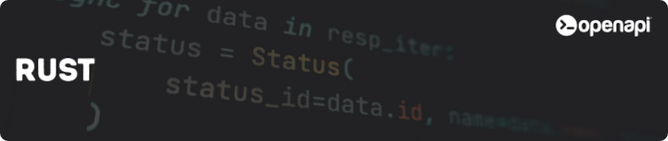

<div align="center">
  <a href="https://openapi.com/">
    
  </a>

  <h1>Openapi® client for Rust</h1>
  <h4>The perfect starting point to integrate <a href="https://openapi.com/">Openapi®</a> within your Rust project</h4>

  [](https://github.com/<username>/<repo>/actions)
  [](https://crates.io/crates/<crate_name>)
  [](https://docs.rs/<crate_name>)
  [](LICENSE)
  [](https://www.rust-lang.org/)
</div>

## Overview

This client provides an idiomatic Rust interface to the APIs available at [Openapi](https://openapi.com).
It simplifies integration with the Openapi Marketplace, offering typed requests, async support, and built-in error handling.
With this SDK you can quickly connect to hundreds of certified APIs and accelerate your digital transformation projects.

## Pre-requisites

Before using the Openapi Rust Client, you will need an account at [Openapi](https://console.openapi.com/) and an API key to the sandbox and/or production environment

## Installation

You can add the Openapi Rust Client to your project with the following command:

```bash
cargo add openapi-sdk
```
    
## Usage

The client has two main operational modes:

### 1. Token Generation (OAuth Client)

Use the `OauthClient` to generate access tokens for API access:

```rust
use openapi_client::OauthClient;
use serde::{Deserialize, Serialize};

#[derive(Debug, Serialize, Deserialize)]
struct TokenResponse {
    token: String,
}

#[tokio::main]
async fn main() -> Result<(), Box<dyn std::error::Error>> {
    // Initialize the OAuth client
    let oauth_client = OauthClient::new("<your_username>", "<your_apikey>", true)?;

    // Create a token for a list of scopes
    let scopes = vec![
        "GET:test.imprese.openapi.it/advance",
        "POST:test.postontarget.com/fields/country",
    ];
    let ttl = 3600;
    let result = oauth_client.create_token(scopes, ttl).await?;

    // The string response can be parsed into a custom object
    let resp: TokenResponse = serde_json::from_str(&result)?;
    println!("Generated token: {}", resp.token);

    // Delete the token when done
    let _result = oauth_client.delete_token(resp.token).await?;

    Ok(())
}
```

### 2. API Calls (Using Access Tokens)

Use the `Client` to make API calls with your access tokens:

```rust
use openapi_client::Client;
use serde::Serialize;
use std::collections::HashMap;

#[tokio::main]
async fn main() -> Result<(), Box<dyn std::error::Error>> {
    // Initialize the client with your access token
    let client = Client::new("<your_access_token>".to_string())?;

    // Make a request with parameters
    let mut params = HashMap::new();
    params.insert("denominazione", "altravia");
    params.insert("provincia", "RM");
    params.insert("codice_ateco", "6201");

    let result = client
        .request::<serde_json::Value>(
            "GET",
            "https://test.imprese.openapi.it/advance",
            None,
            Some(params),
        )
        .await?;

    println!("API Response: {}", result);

    // Make a request with a JSON payload
    #[derive(Serialize)]
    struct Query {
        country_code: String,
    }

    #[derive(Serialize)]
    struct Payload {
        limit: u64,
        query: Query,
    }

    let query = Query {
        country_code: "IT".to_string(),
    };
    let payload = Payload { limit: 10, query };

    let result = client
        .request(
            "POST",
            "https://test.postontarget.com/fields/country",
            Some(&payload),
            None,
        )
        .await?;

    println!("POST Response: {}", result);

    Ok(())
}
```

## Examples

You can find complete examples in the `examples/` directory:

- `examples/token_generation.rs` - Token generation example
- `examples/api_calls.rs` - API calls example

Run examples with:
```bash
cargo run --example token_generation
cargo run --example api_calls
```

## Testing

Run tests with:
```bash
cargo test
```

## Contributing

Contributions are always welcome! See [docs/contributing.md](docs/contributing.md) for ways to get started. Please adhere to this project's [docs/code-of-conduct.md](docs/code-of-conduct.md).

## Authors

- [@maiku1008](https://www.github.com/maiku1008)
- [@openapi-it](https://github.com/openapi-it)

## License

This project is licensed under the [MIT License](LICENSE).

The MIT License is a permissive open-source license that allows you to freely use, copy, modify, merge, publish, distribute, sublicense, and/or sell copies of the software, provided that the original copyright notice and this permission notice are included in all copies or substantial portions of the software.

In short, you are free to use this SDK in your personal, academic, or commercial projects, with minimal restrictions. The project is provided "as-is", without any warranty of any kind, either expressed or implied, including but not limited to the warranties of merchantability, fitness for a particular purpose, and non-infringement.

For more details, see the full license text at the [MIT License page](https://choosealicense.com/licenses/mit/).
